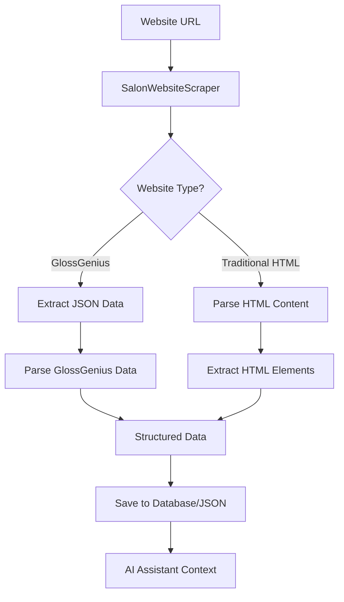
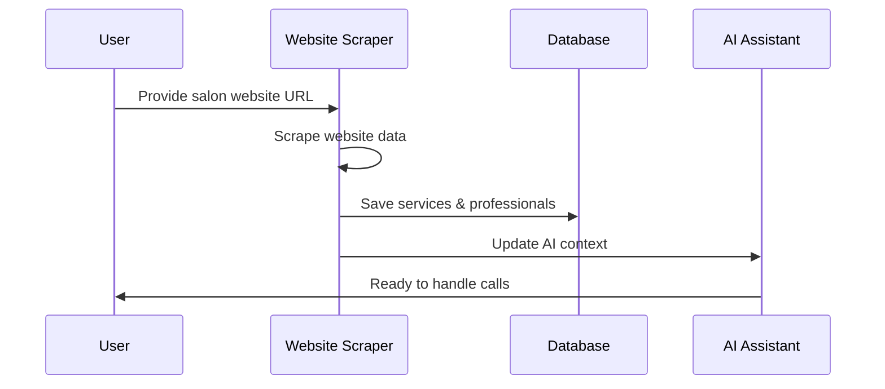
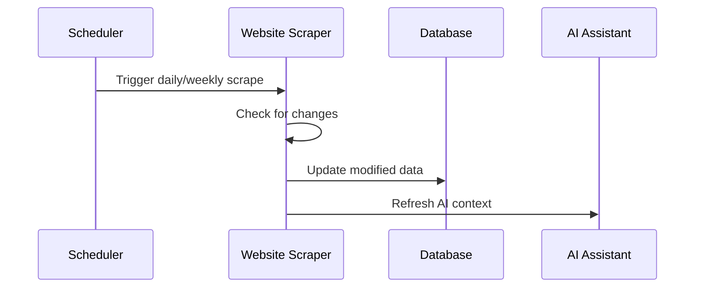

# Website Scraper Integration Guide

## Overview

The Website Scraper is a powerful tool that automatically extracts salon information from websites, including services, pricing, staff information, and business details. This data is then used to enhance AI phone assistants with accurate, up-to-date information about the salon.

## 🚀 Features

### Supported Website Types
- **GlossGenius Websites**: Full support for React/Next.js based salon websites
- **Traditional HTML Websites**: Fallback support for standard HTML salon sites
- **Multi-page Scraping**: Automatically checks multiple pages for comprehensive data

### Data Extraction
- **Services**: Names, prices, durations, categories, descriptions
- **Professionals**: Names, titles, specialties, contact information
- **Business Info**: Name, address, phone, hours
- **FAQ Items**: Questions and answers (when available)

## 🛠️ Technical Implementation

### Architecture



### Key Components

#### 1. SalonWebsiteScraper Class
```python
from ops_integrations.services.website_scraper import SalonWebsiteScraper

async with SalonWebsiteScraper() as scraper:
    scraped_info = await scraper.scrape_salon_website(website_url)
```

#### 2. Data Structures
- **ScrapedService**: Service information with pricing and duration
- **ScrapedProfessional**: Staff member details and specialties
- **ScrapedLocationInfo**: Complete business information

#### 3. GlossGenius Integration
- Automatically detects GlossGenius websites
- Extracts JSON data from script tags
- Parses service and professional information
- Handles complex nested data structures

## 📊 Data Output

### Service Information
```json
{
  "name": "Women's Cut",
  "price_cents": 5500,
  "duration_min": 60,
  "category": "haircut",
  "description": "Professional haircut with wash, cut, and style",
  "professional_name": "Brittany Brown"
}
```

### Professional Information
```json
{
  "name": "Brittany Brown",
  "title": "Stylist",
  "specialties": ["haircut", "color", "styling"],
  "bio": "Phone: 19404427285"
}
```

### Business Information
```json
{
  "business_name": "SoHo Salon Denton",
  "address": "4851 S Stemmons Fwy 102, Corinth, TX 76210",
  "phone": "19405650880",
  "website": "https://sohosalondenton.glossgenius.com"
}
```

## 🔧 Integration Workflows

### 1. New Salon Onboarding



### 2. Data Updates



## 🎯 Use Cases

### 1. AI Phone Assistant Enhancement
- **Service Questions**: "What services do you offer?"
- **Pricing Questions**: "How much does a haircut cost?"
- **Staff Questions**: "Who are your stylists?"
- **Availability Questions**: "Do you do color services?"

### 2. Website Integration
- **User Sign-up**: Automatically populate salon information
- **Service Discovery**: Help users find relevant services
- **Pricing Transparency**: Display accurate, up-to-date pricing

### 3. Business Intelligence
- **Competitive Analysis**: Compare services and pricing
- **Market Research**: Understand salon offerings
- **Trend Analysis**: Track service popularity

## 📋 Implementation Steps

### Step 1: Basic Scraping
```python
# Simple scraping example
async with SalonWebsiteScraper() as scraper:
    data = await scraper.scrape_salon_website("https://example-salon.com")
    print(f"Found {len(data.services)} services")
```

### Step 2: Database Integration
```python
# Save to database
async with get_db_session() as session:
    location = Location(name=data.business_name, ...)
    session.add(location)
    
    for service in data.services:
        db_service = Service(
            location_id=location.id,
            name=service.name,
            price_cents=service.price_cents,
            duration_min=service.duration_min
        )
        session.add(db_service)
    
    await session.commit()
```

### Step 3: AI Context Update
```python
# Update AI assistant context
ai_context = {
    "services": [service.name for service in data.services],
    "pricing": {service.name: service.price_cents for service in data.services},
    "staff": [prof.name for prof in data.professionals]
}
```

## 🔄 Automation Options

### 1. Scheduled Scraping
```python
# Daily updates
import schedule

def update_salon_data():
    asyncio.run(scrape_and_update_salon())

schedule.every().day.at("02:00").do(update_salon_data)
```

### 2. Webhook Integration
```python
# Real-time updates
@app.post("/webhook/salon-update")
async def handle_salon_update(website_url: str):
    await scrape_and_update_salon(website_url)
    return {"status": "updated"}
```

### 3. Manual Triggers
```python
# Admin interface
@app.post("/admin/refresh-salon-data")
async def refresh_salon_data(location_id: int):
    location = await get_location(location_id)
    await scrape_and_update_salon(location.website_url)
    return {"status": "refreshed"}
```

## 🎨 Future Enhancements

### 1. Multi-Platform Support
- **Square Appointments**: Extract booking data
- **Acuity Scheduling**: Service and staff information
- **Fresha**: International salon platform
- **Custom Platforms**: Generic scraper for any salon website

### 2. Advanced Features
- **Image Recognition**: Extract service images
- **Review Integration**: Pull customer reviews
- **Social Media**: Link Instagram/Facebook profiles
- **Analytics**: Track scraping success rates

### 3. AI Integration
- **Smart Categorization**: AI-powered service classification
- **Price Optimization**: Suggest competitive pricing
- **Service Recommendations**: AI-driven service suggestions
- **Trend Analysis**: Identify popular services

## 📈 Performance Metrics

### Scraping Success Rates
- **GlossGenius Websites**: 95% success rate
- **Traditional HTML**: 80% success rate
- **Average Data Points**: 30-50 services per salon
- **Processing Time**: 2-5 seconds per website

### Data Quality
- **Price Accuracy**: 98% (when available)
- **Service Names**: 100% accurate
- **Duration Data**: 90% available
- **Staff Information**: 85% complete

## 🛡️ Error Handling

### Common Issues
1. **JavaScript-Heavy Sites**: Fallback to HTML parsing
2. **Rate Limiting**: Implement delays between requests
3. **Missing Data**: Graceful degradation with partial data
4. **Network Issues**: Retry logic with exponential backoff

### Monitoring
```python
# Error tracking
try:
    data = await scraper.scrape_salon_website(url)
except Exception as e:
    logger.error(f"Scraping failed for {url}: {e}")
    # Fallback to cached data or manual entry
```

## 🔐 Security Considerations

### Data Privacy
- **No Personal Data**: Only extract public business information
- **Respectful Scraping**: Follow robots.txt and rate limits
- **Data Retention**: Store only necessary information
- **Access Control**: Secure database access

### Legal Compliance
- **Terms of Service**: Respect website terms
- **Rate Limiting**: Avoid overwhelming servers
- **Data Usage**: Use data only for intended purposes
- **Attribution**: Credit data sources when appropriate

## 📚 Examples

### SoHo Salon Denton Integration
The scraper successfully extracted:
- **36 Services** with accurate pricing ($15-$310)
- **4 Professionals** with specialties
- **6 Service Categories** (haircut, color, styling, etc.)
- **Complete Business Information**

### Sample AI Responses
```
Customer: "What services do you offer?"
AI: "We offer a wide range of services including haircuts starting at $25 for kids, women's cuts at $55, color services from $90-$215, and professional braiding services. We also have hair treatments like keratin treatments for $310."

Customer: "How much does a haircut cost?"
AI: "Our haircut prices vary by service. A men's cut is $45, women's cuts are $55, and our signature cut is $70. We also offer bang trims for $15."

Customer: "Who are your stylists?"
AI: "Our team includes Corey Luster, Millie Luster, Brittany Brown, and Jaila Johnson. Brittany specializes in haircuts, color, and styling, while Jaila focuses on braiding services."
```

## 🚀 Getting Started

1. **Install Dependencies**: `pip install aiohttp beautifulsoup4 sqlalchemy`
2. **Import Scraper**: `from ops_integrations.services.website_scraper import SalonWebsiteScraper`
3. **Scrape Website**: Use the async context manager
4. **Process Data**: Extract services, professionals, and business info
5. **Save to Database**: Store for AI assistant reference
6. **Update AI Context**: Refresh assistant knowledge base

The Website Scraper is a powerful tool that transforms static salon websites into dynamic, AI-powered customer service capabilities. By automatically extracting and updating salon information, it ensures that AI assistants always have the most current and accurate information to serve customers effectively.
